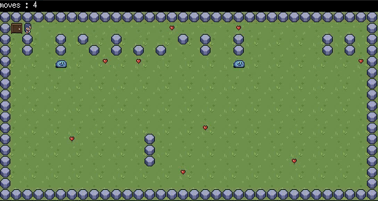

# So_Long

!So_Long

This is a project at 42, and the first graphical project using the MiniLibX.

So_Long is a side-scrolling game similar to Mario Bros.

The player's goal is to collect all the coins on the map and then escape with the minimum number of movements.

<div align="center"></div>

---

## Installation

### Cloning the repositories
```shell
sudo apt-get install gcc make xorg libxext-dev libbsd-dev
git clone https://github.com/aogbi/so_long-2D-game-.git
cd so_long-2D-game-
```

## Compilation:

To compile the project, run the following command:

```
make
```

## Usage:

To launch the game, use `./so_long` followed by the `map name`.

Example:

```
./so_long map/map3.ber
```

## Controls:

| Keyboard | Action |
|---|---|
| <kbd>↑</kbd>| Up |
|  <kbd>↓</kbd>| Move Down |
|  <kbd>←</kbd>| Move Left |
|<kbd>→</kbd>| Move Right |
|<kbd>Space</kbd>| Attack |
| <kbd>ESC</kbd>, `⎋`| Close the game |

---

## Map Structure:

| Character | Description|
|--|--|
| `0` | Empty Space |
| `1` | Wall |
| `P` | Player |
| `E` | Exit Door |
| `C` | Collectable Coin |
| `A` | Monster |

---
